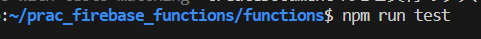
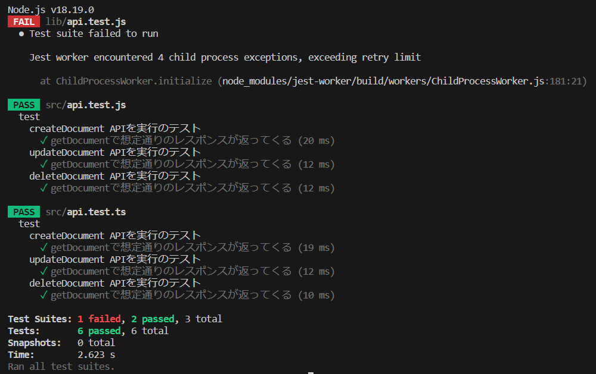

# prac_firebase_functions

Firebase EmulatorでCloudFunctionsとFirestoreを起動・実行するサンプルプロジェクト

参考　https://zenn.dev/nananaoto/articles/9bff8b9eca891656c110


# 使い方


## ビルド

```
cd functions
npm run build
```


## emulatorの立ち上げ

```
firebase emulators:start
```


## テストの実行

```
npm run test
```


特定のテストだけ実行する場合

```
npm run test -- -t 'createDocument APIを実行のテスト'
```


### 手作業で実行する場合

emulatorsで起動したCloudFunctionsはデフォルトで、`https://localhost:$ポート番号/$PROJECT/us-central1/$関数名`のようなエンドポイントで実行可能。ブラウザでアクセスしてもfunctionsが実行される。

- 作成：http://localhost:5001/prac-firebase-functions/us-central1/createDocument
- 更新：http://localhost:5001/prac-firebase-functions/us-central1/updateDocument
- 削除：http://localhost:5001/prac-firebase-functions/us-central1/deleteDocument


## テスト結果

jest内部で循環参照が発生して一部失敗する。





